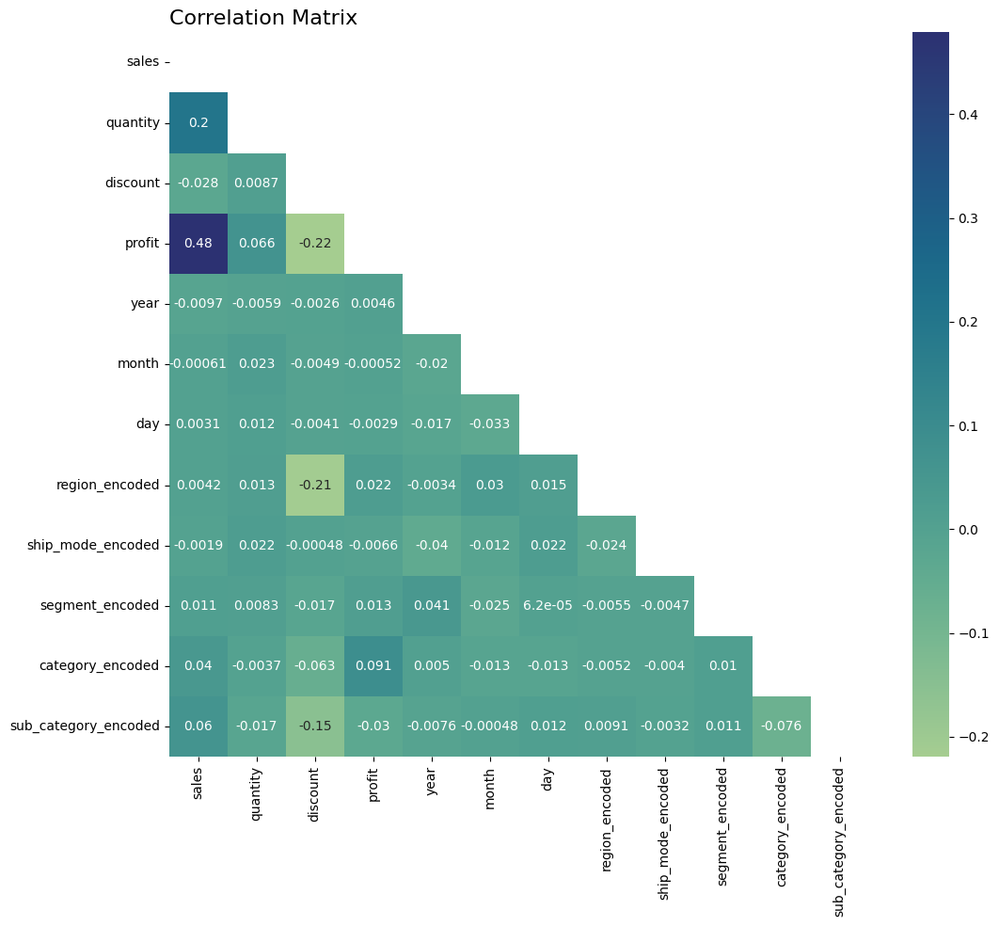
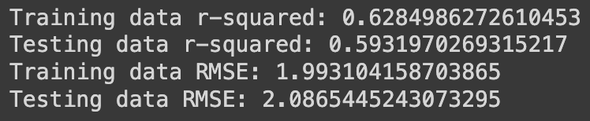
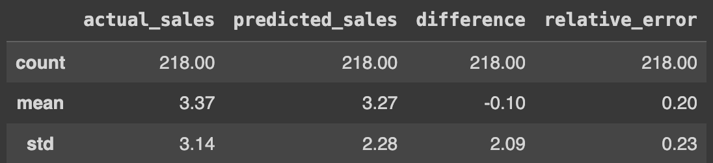
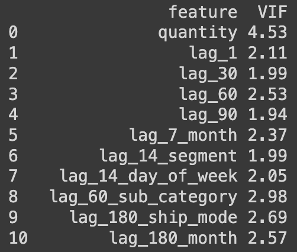

# Sales Forecasting by Region

Project File: <a href="#">Python File</a>

## Executive Summary
The primary goal of this project is to develop a sales forecasting model for **SuperStore**, a fictitious company from **Tableau's** sample data. The aim is to predict future sales and identify factors that influence sales in different regions. Through this project, it was discovered that sales drivers vary significantly across regions, requiring distinct models for each. 

The tools used include **Python** and its libraries:
- Pandas, 
- NumPy, 
- Matplotlib, 
- Seaborn, 
- Plotly, 
- Scikit-learn, and 
- Statsmodels. 

Ridge regression was used to handle overfitting issues. The main findings highlighted the impact of discounts and seasonality on sales and the importance of including lag and interactive features in the model. 

Key recommendations include:
- Exploring advanced models like AutoRegressive Integrated Moving Average (ARIMA) or Long Short-Term Memory (LSTM) for better accuracy, 
- Focusing resources on the West region, 
- Optimizing inventory levels based on seasonal trends and 
- Improving discount strategies.

## Business Problem
This project aims to forecast sales for the upcoming year. Accurate forecasts will guide the business in inventory management, marketing strategies, and staffing needs, ensuring efficient resource allocation and maximizing profitability. Effective sales forecasting is crucial for making informed decisions, improving operational efficiency, and enhancing strategic planning.

## Data Sources
The data used in this project comes from **Tableau’s** free and available datasets, specifically **SuperStore’s** sales and order details from 2019 to 2022. The data was downloaded directly from **Tableau**. A significant limitation is that this data is based on a fictitious company, potentially lacking realism and failing to represent real-world sales dynamics accurately.

## Methodology
The analysis began with data cleaning using **Pandas** and **Numpy** libraries in **Python**, focusing on key columns such as *order_id*, *order_date*, *ship_mode*, *segment*, *state*, *region*, *product_id*, *category*, *sub_category*, *sales*, *quantity*, *discount*, and *profit*. 

Other steps used in the data analysis:
- Duplicate rows were removed, and data types were converted for analysis. 
- Visualizations were created using **Plotly**, **Matplotlib**, and **Seaborn**. 
- Multivariable regression analysis, particularly Ridge regression, was employed to create the forecasting model. 
- Additional analyses, including Root Mean Square Error (RMSE), Variance Inflation Factor (VIF), regression coefficients, residuals analysis, and Mean Absolute Percentage Error (MAPE), were conducted to ensure model accuracy and address multicollinearity issues.

## Visualization

## Analysis
This project mainly used predictive and exploratory data analyses to see the relationships between variables and to predict future sales. Correlation and Ridge regression analyses were conducted to identify relationships between sales and other variables. 

Correlation analysis revealed that most order features had weak relationships with sales, with profit and quantities sold being notable exceptions. 

Based on the result of the correlation analysis, lag and date features were added to make interactive features. Each region model has different interactive features that correlate with sales.

Ridge regression showed that using *log(sales)* improved model accuracy. 

 

RMSE and MAPE analyses confirmed the model’s predictive capability with acceptable error margins. 

VIF analysis ensured minimal multicollinearity among independent variables.

*(Data is from the West Region model. Open the Python file to see the results for other regions.)*

## Results & Business Recommendations
The main findings indicate regional differences in sales drivers, the positive impact of discounts in the Central and East regions, the negative impact of discounts in the South region, and the importance of lag and date features. The West region emerged as the top-performing region. Recommendations include:
- Enhancing the model with advanced techniques like ARIMA or LSTM
- Collecting more data for deeper insights
- Prioritizing the West region for growth
- Adjusting discount strategies based on regional performance
- Optimizing inventory and marketing efforts around technology products and consumer segments

Implementing these recommendations will enhance sales forecasting accuracy, improve resource allocation, and drive strategic growth.

## Skills Utilized
Key skills applied in this project include: 
- Python proficiency,
- data cleaning, 
- data manipulation, 
- Exploratory Data Analysis (EDA),
- statistics, 
- regression analysis and 
- problem-solving. 

These skills were crucial in overcoming data limitations and developing an effective forecasting model.

## Challenges and Solutions
One major challenge was the weak relationship between order features and sales. This was addressed by employing Ridge regression and incorporating interaction features. Multicollinearity and overfitting were managed using VIF and additional analyses, ensuring a robust model.

## Next Steps
Further actions include exploring advanced machine learning models and collecting more data for enhanced accuracy. The proposed timeline includes short-term model improvement and long-term data collection and analysis.

## Conclusion
This project has made a sales forecasting model for SuperStore, providing actionable insights and strategic recommendations. The learnings include the importance of being resourceful and advanced analytical techniques in handling complex data challenges. These findings and recommendations will enable SuperStore to make informed, data-driven decisions, optimizing their operations and driving growth.
